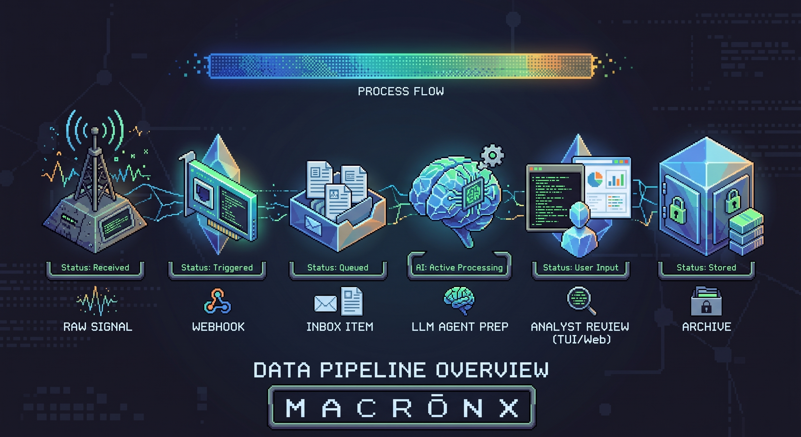

# MacronX

MacronX is a personal Open-Source Intelligence (OSINT) intake and analysis pipeline. It acts like an automated team of analysts: signals from devices, open-source feeds, social media scrapers, and APIs land in a single inbox, are automatically processed by LLM workflows, and then queued for your review via the web interface or `macronx-tui`.

The app is built around a simple idea: **capture -> process with AI -> analyze**. Most intelligence artifacts are designed to be automatically processed by workflows as they arrive. You simply review the generated insights—such as Executive Intelligence Briefs, trend analyses, or parsed transcripts—and then archive them.

## What it is

MacronX is a Rails application for collecting and processing intelligence artifacts at scale. It gives you authenticated inbox items with sources, tags, attachments, structured payloads, metadata, workflow assignment, processed state, and archive state.

Use it as the integration point between raw data collection and human analysis:

Today, MacronX provides the inbox, workflow, tagging, attachment, filtering, and API ingestion primitives. LLM-powered intelligence workflows are built on top of those primitives to automatically synthesize raw data.

## Why it exists

OSINT operations are most effective when analysts can rapidly collect context from multiple sources: news feeds, social media, intercepted audio, field imagery, and research notes. Without a common intake point, these artifacts become scattered across disconnected tools.

MacronX acts as the shared intelligence intake layer. It lets you capture raw signals quickly, preserve structured context, and automatically route them to LLMs for synthesis. Instead of spending time manually parsing raw data, you spend your time reading the generated reports and making strategic decisions.

MacronX is designed to stay secure and cheap to run. The Rails app, development database, and file storage run locally on your machine, ensuring sensitive intelligence stays private. Workflows are intended to call local LLMs (Ollama, LM Studio, mlx, and similar) wherever possible, reserving paid cloud APIs for cases that truly need them.

## Example workflows

### News Analysis

Automatically process your daily intelligence feeds. Articles are gathered into an inbox item, and an LLM workflow synthesizes the raw data to produce an Executive Intelligence Brief (EIB) identifying macro-trends, geopolitical risks, and technological shifts.
*See prompt: [news_analysis.md](prompts/news_analysis.md)*

### Social Discourse & Trends

Monitor platforms like X (Twitter) or Reddit for emerging narratives. A scraper pushes a JSON payload of trending conversations via the API, and an LLM workflow identifies competing factions, escalation risks, and the strategic implications of the discourse.
*See prompts: [x_trends.md](prompts/x_trends.md), [reddit_trends.md](prompts/reddit_trends.md)*

### Audio Intercepts & Transcription

Upload or pipe in raw audio files (e.g., from public speeches, intercepted comms, or analyst field notes). MacronX automatically transcribes the audio using local Whisper models, making the transcript available for subsequent LLM analysis, summarization, or translation.
*See prompt: [audio_transcript.md](prompts/audio_transcript.md)*

### Image Intelligence (IMINT)

Capture images from the field (e.g., via Meta glasses, drones, or web captures) and send them to a webhook adapter. The adapter creates an inbox item with the image attached, triggering an analyst-style threat assessment or geographical analysis workflow.
*See prompt: [image_analysis.md](prompts/image_analysis.md)*

### Manual fallback

When a raw signal cannot be analyzed automatically, it remains unprocessed in the inbox. From there it can be searched, filtered by source or tag, edited, archived, bulk-tagged, or manually marked as processed through an appropriate workflow.

## OSINT Prompt Library

MacronX includes a library of sample prompts tailored for OSINT analysts, located in the `prompts/` directory. These can be used directly as workflow templates:

- [**News Analysis**](prompts/news_analysis.md): Synthesize daily feeds into an Executive Intelligence Brief (EIB).
- [**X (Twitter) Trends**](prompts/x_trends.md): Analyze top discourse conversations for strategic narrative intelligence.
- [**Reddit Trends**](prompts/reddit_trends.md): Identify sentiment and emerging narratives from subreddit data.
- [**Image Analysis**](prompts/image_analysis.md): Conduct threat assessments and contextual analysis on imagery.
- [**Audio Transcription**](prompts/audio_transcript.md): Process and summarize transcribed audio intercepts.

## Terminal UI

A GPU-friendly Rust TUI is available for keyboard-driven work with MacronX. Built with ratatui, it features:

- Inline image preview via terminal graphics protocols (Kitty, iTerm2, Sixel)
- Inline audio playback with seek, volume controls, and waveform visualization
- Markdown body rendering with word-wrapping
- Keyboard-driven inbox listing, filtering by tag, and detail inspection

Get it at [macron1-automations/macronx-tui](https://github.com/macron1-automations/macronx-tui).

## Documentation

- **[Setup & Configuration](docs/SETUP.md)**: Detailed instructions on local development, LLM configuration, database setup, ngrok tunneling, and security notes.
- **[Daily RSS Feed digest](docs/RSS_FEEDS.md)**: Details on the daily feed digest, schedule, and how to run it manually. This digest automatically feeds into the [News Analysis](#news-analysis) workflow.
- **[Audio transcription](docs/AUDIO_TRANSCRIPTS.md)**: Details on supported audio formats, automatic transcription workflows, and prompt examples.
- **[Maintenance](docs/MAINTENANCE.md)**: Details on routine maintenance tasks, including reprocessing existing items through updated workflows.
- **[API ingestion](docs/API.md)**: Details on API ingestion, endpoints, and authentication.
